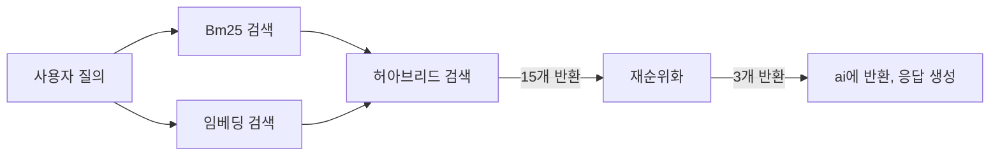
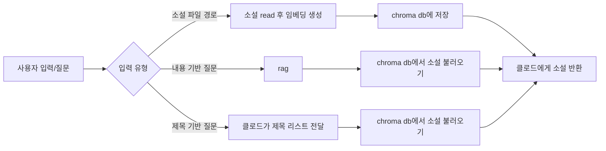

# 상세 설명
1. 아키텍처
2. 검색 방법 및 파라미터 설정
3. 문제 해결 및 시행 착오
4. 마무리

## 1. 아키텍처
* 베이스 버전_ 'gemma-4-26b-a4b-it' 모델 이용(랭체인으로 구글 ai api 호출하여 사용)

* mcp 서버_sonnet 4.6 이용 (claude desktop과 연결)

## 2. 검색 방법 및 파라미터 설정
### 검증용 데이터
* 허깅페이스의 소설 데이터 'werty1248/Korean-1930-Novel-Scene-Summarize' 이용
  * 전체 다 하면 너무 많아서 앞 600개 자른 후 다섯 개씩 묶어서 한 회차로 만들어 사용했다.(한 회차 약 3000자, 총 97회차)
  * 백치 아다다, 며느리, 죄와 벌 등 13개 소설이 포함됐다.
* 각 모델, 방식, 파라미터의 정확도를 비교하기 위해 97개의 소설 회차를 클로드에게 하나씩 보여주며 질문을  10개씩 만들어 달라고 부탁해 총 970개의 질문을 확보했다. (novel_question.txt 파일에 저장)
  
### 임베딩 모델 정하기
* 단독으로 맞힌 개수(hit@3) 비교해서 모델 정하기
* 후보들: 'snunlp/KR-SBERT-V40K-klueNLI-augSTS', 'jhgan/ko-sroberta-multitask', 'intfloat/multilingual-e5-base'
* 각각 249개, 308개, 464개 맞혀서 최종 'intfloat/multilingual-e5-base' 모델을 선택했다.
* 참고로 bm25 토큰화 모델은 'klue/roberta-base'이고, 단독으로 634개 맞혔다.

### 파라미터 별 비교

#### 비교할 파라미터들
* bm25 값을 나누거나 정규화할 싱수 x
  * 0부터 1 사이의 값을 가지는 의미 검색과 달리, bm25(키워드) 검색 결과 값은 상한선이 없어서 스케일링이 필요했다.
  * bm25를 x로 나눠 단순히 크기를 줄인 방식과 bm25 / (x+bm25)로 정규화해 범위를 맞춘 방식을 모두 비교해보았다.
* 각 검색 결과의 반환 개수 k
* 비율 합산의 경우 합산 비율
  
#### 시도해본 방식들
* 단순 합산: bm25를 x로 나눠서 바로 합산
* 비율 합산: bm25 / (x+bm25)로 정규화한 뒤 비율 곱해서 합산
* 동적 비율 합산: bm25 / (x+bm25)로 정규화한 뒤 bm25 값을 비율로 이용해서 합산
  * bm25 * bm25, 임베딩 * (1-bm25)
* 점수가 아닌 순위를 합산하는 방식도 시도해보았으나 다른 방식들에 비해 월등히 낮게 나와서 (약 100개 차이) 고려하지 않기로 했다. 

#### 각 방식 별 최고 기록

  | 방식 | 파라미터 | 맞힌 개수(hit@3)|
  |:----:|:----:|----:|
  |비율 합산| 1대 9, x=10, k=15 | 650|
  |단순 합산| x=4, k=15 | <b>661</b>|
  |동적 비율 합산| x=14 , k=10| 641|
    
### 요약문 생성 후 비교
* 최고가 661개로 정확도가 70%에도 못 미쳐서 구글 gemma 모델로 요약문 생성 후 다시 비교해봤다.

    | 방식 | 파라미터 | 맞힌 개수(hit@3)|
    |:----:|:----:|----:|
    |비율 합산| 4대 6, x=10, k=10|<b>768</b>|
    |단순 합산| x=4, k=10|759|
    |동적 비율 합산| x=8, k=10|744|

* bm25는 키워드 방식이니 원문이 더 낫지 않을까 하여 임베딩은 요약문, bm25는 원문을 이용하여 한 번 해보았다.

    | 방식 | 파라미터 | 맞힌 개수(hit@3)|
    |:----:|:----:|----:|
    |비율 합산| 1대 9, x=20, k=20|836|
    |단순 합산| x=4, k=20|<b>838</b>|
    |동적 비율 합산| x=4, k=10|800|

### 하이브리드 검색 튜닝 결과
* 최종 선택: 임베딩+요약문, bm25+원문
* 각 방식 단독으로 했을 때(원문 기준) 464, 634개에서 838개까지 늘어났지만 여전히 만족할 만한 수치는 아니었다. 정확도를 조금 더 높일 수 있는 방법을 찾아보던 중 rerank(재순위화)에 대해 알게 되어 바로 시도해보았다.
  
### 재순위화를 위한 파라미터 재설정+반환 개수 설정
* 처음엔 모델을 직접 다운 받아서 해보려 하였으나 재순위화 한 번에 1분 넘게 걸려서 cohere api를 이용하기로 했다.
* rerank 모델에 넘길 반환 개수 a를 정하고, 그에 맞춰 하이브리드 검색의 hit@a를 알아야 하기 때문에 다시 파라미터를 바꿔가며 최고 기록을 비교해봤다.

    |  | hit@10| hit@15| hit@20|
    |----|----:|----:|----:|
    |**방식**| 단순 합산|비율 합산|단순 합산
    |**파라미터**| x=4, k=20|1대 9, x=10, k=30|x=6, k=25|
    |**맞힌 개수**|946|**958**|962|
  * hit@15와 hit@20의 차이가 불과 4개로, hit@15-hit@10에 비해 1/4 수준이라 hit@15로 결정했다.
* 하이브리드 + rerank: 약 924개
  * 하이브리드가 15개 내에 정답을 뽑은 958개 중 샘플링 200개 해서 rerank 결과 확인: 193/200 = 96.5%
  * 958 * 96.5% = 924.47개
* 원문+원문 조합일 때 (mcp server는 원문만 이용): 약 912개
  * 하이브리드 검색 결과(hit rate@15) = 945
  * 945 * 96.5% = 911.925
<pre><code>
<b>임베딩</b>
* 모델: 'intfloat/multilingual-e5-base'
* 요약문 이용
* 30개 반환(하이브리드 검색으로)

<b> bm25</b>
* 토크나이저:'klue/roberta-base'
* 원문 이용
* <i>bm25/(15+bm25)</i>로 정규화 
* 30개 반환(하이브리드 검색으로)

<b>하이브리드</b>>
* 임베딩 1 대 bm25 9 비율로 더함
* 상위 15개 반환(rerank로)

<b>재순위화(rerank)</b>
* 모델: cohere api "rerank-v3.5"
* 상위 3개 반환 (최종)
</code></pre>

## 3. 문제 해결 및 시행 착오
### rag 기능이 제목 기반 질의에 약하다는 문제점
* 문제: "죄와벌 1화, 죄와벌 2화", "죄와 벌 1화와 2화", "죄와벌 1~4화" 등 사용자가 명시적으로 제목을 표함하여 질문했을 때, rag로는 잡기 힘들고 파이썬 코드로는 예외 처리에 한계가 있었다.
* 그래서 사용자 질문으로부터 제목 리스트를 불러오는 걸 클로드에게 맡겨볼까 생각했고, 실제로 잘 작동했다. 아래는 제목에 띄어쓰기를 포함하여 질의한 뒤(저장된 원래 제목은 띄어쓰기 없이 '죄와벌'), 클로드의 답변을 확인한 결과이다. 
  <pre>  </pre>
  
### llm의 콘텐츠 누락(절단)
* 문제1: 소설 관련 질문 생성 과정에서의 누락
  * 클로드에게 소설을 한 회차씩 보여주며 질문을 만들어 달라고 요청했을 당시, 97개 회차가 끝나고 클로드에게 지금까지 질문을 모두 모아 하나의 파일로 만들어 달라고 했지만 일부 질문이 누락되었다.
* 문제2: read 기능_소설 원문 전달 시 절단
  * read 기능을 처음 구현했을 때는 사용자가 직접 파일을 보여주면 클로드가 소설 내용을 서버에게 전달하고 서버가 임베딩한 후 db에 저장하도록 구현했다. 그런데 원문을 그대로 전달하라고 명시했음에도 생략해서 전달하는 문제가 발생했다.
* 긴 콘텐츠를 다루거나 원문 그대로 전달하는 작업을 llm에게 일임하기는 무리라는 걸 알게 되었다. 질문들은 수동으로 취합해 파일을 완성했고, read 기능은 사용자가 파일을 직접 넘기는 대신 파일 경로를 넘기는 걸로 수정하였다. 사용자가 파일 경로를 입력하면 클로드가 경로를 서버에게 넘기고, 서버가 파일을 읽어 db에 저장한 후 클로드에게 원문을 넘기는 방식이다.
  
### 비동기 처리 테스트
#### 하나의 요청
* rag 기능의 하이브리드 검색은 사용자 질의 임베딩과 소설 내용 bm25 빌드 과정이 있어 약간의 시간이 소요된다. 0.1초가 조금 넘는 시간이지만 두 작업을 동시에 진행할 수 있으니 비동기 처리하면 더 빠르게 응답할 수 있지 않을까 싶어 두 작업을 비동기 처리하고 테스트 해보기로 했다.
* 그러나 원래 동기 작업인 것들을 비동기 함수로 만드는 과정에서 더 시간이 걸렸는지, 오히려 소요 시간이 소폭 증가했다.

#### 여러 요청 보내기
* 하나의 요청엔 의미가 없을 지라도 동시에 여러 개의 요청이 올 땐 효과가 있을 것 같아 여러 요청을 보내고 소요 시간을 비교해보기로 했다.
* 첫번째 시도: 처음엔 배포를 해야만 요청을 보낼 수 있는 줄 알고 배포를 진행했었다. render 무료 플랜으로 배포를 시도했는데, 임베딩 모델을 작은 거로 바꾸고 양자화까지 진행했지만 메모리 문제가 계속 반복되어 결국 배포는 포기했다.
* 두 번째 시도: 다시 찾아본 결과 배포를 하지 않아도 요청을 보낼 수 있다는 걸 알게 되었고, 파이썬 스크립트로 10개의 요청을 보내 테스트 해보았다. 그 결과 임베딩과 bm25 빌드를 동시에 하는 건 여전히 효과가 없었고, 재순위화를 위해 사용한 cohere api를 비동기로 처리하니 전체 4초대에서 2초대 정도로 시간이 감소한 것을 확인 할 수 있었다. (전체 소요 시간은 세션 초기화 시간과 모델 로드 시간이 포함된 시간.)
* 소요 시간 비교
  <pre>
    
    
     
    
</pre>

## 4. 마무리
* 구현 과정에서, 그리고 테스트 과정에서 클로드를 많이 활용해서 완성한 프로젝트였다. 원래는 구글링을 많이 했는데, 이번엔 궁금한 게 생길 때 가장 먼저 클로드에게 물어봤고, mcp 서버 테스트 하면서 클로드에게 직접 기능은 어떤지, 설명(tool description)은 또 어떤지 물어보며 수정해하며 완성했다.
#### 개선점
* 멀티 테넌시(multi-tenancy) 구현
  * 현재 문제: 하나의 db, 컬렉션만 사용하고 있어 실제 서비스에는 부적합
  * 세션을 부여해서 사용자 별로, 용도 별로 db 혹은 테이블(컬렉션)을 분리하여 사용할 수 있도록 구현
* 소설 도메인 특화
  * 현재 문제: 소설 데이터를 사용하긴 했지만 소설만의 특징을 살리지 못했다.
  * 소설 rag인 만큼 여러 인물이 나오고 대사와 서술이 있는 등 소설만의 특징을 활용하여 rag 검색 기능 보완
* Adaptive top-k 도입
  * 현재 문제: 참고할 소설이 많이 필요한 경우, 뽑힌 소설들의 유사도 등을 고려하지 않고 고정적 개수(3개) 반환  
  * 상황에 따라 반환하는 소설 개수 조절하도록 구현
